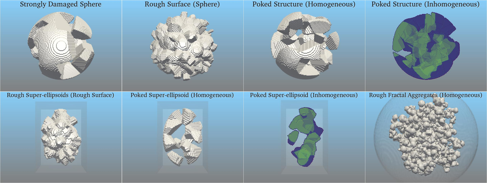

Rough Ellipsoid Structure Tools (REST)
===================================

**REST** is a Java GUI application package for generating realistic cosmic dust structures.
It uses the CALLTARGET function from DDSCAT to generate ELLIPSOIDS or SUPER-ELLIPSOIDS as base structure depending on the selected structure and shape parameters like the *radius*, *semi-axes* and *exponents*. The program asks the user to provide *seed* cells which are initial set of points randomly selected for the *material* and *space* from the base structure. Depending on the type and number of seeds generated, the code cuts the base structure into *STRONGLY DAMAGED SPHERE (SDS)*, *ROUGH SURFACES (RS)*, *POKED STRUCTURES (PS)* and *ROUGH FRACTAL AGGREGATES (RFA)* by measuring the distance of each point with respect to the *seed* points.
**REST** uses following algorithms to creaft different cosmic dust structures:

        1. **Strongly Damaged Sphere (SDS)**
        2. **Rough Surface (RS)**
        3. **Poked Structure (PS)**
        4. **Rough Surface Super-ellipsoid (RS-SE)**
        5. **Poked Structure Super-ellipsoid (PS-SE)**
        6. **Rough Fractal Aggregates (RFA)**

.. note::
        The above mentioned algorithms are the fundamental procedures and can be used to develope new kind of dust morphologies that are yet to be                 configured.

Check out the :doc:`usage` section for further information, including
how to :ref:`installation` the project.

Contents
--------

.. toctree::

   usage
   tutorial
   download
