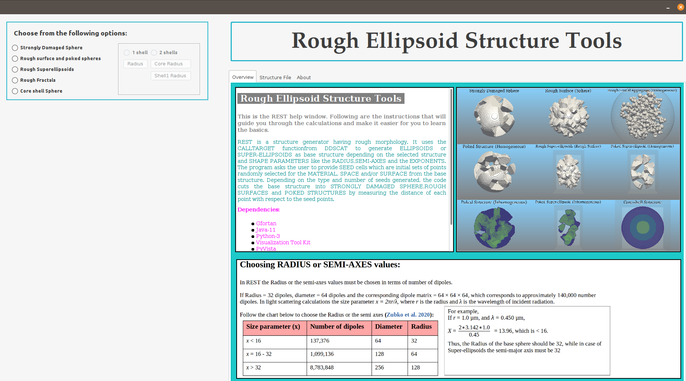
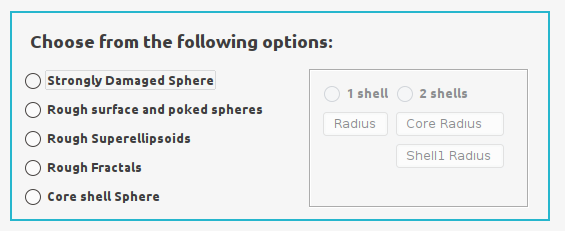
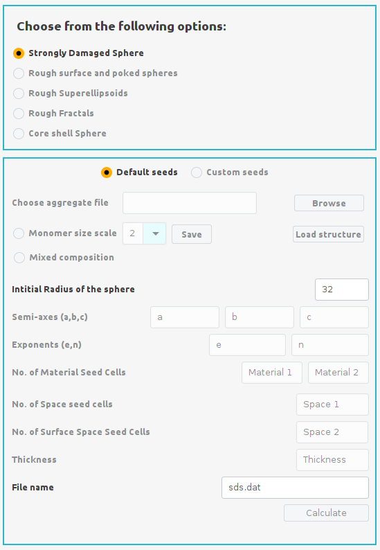
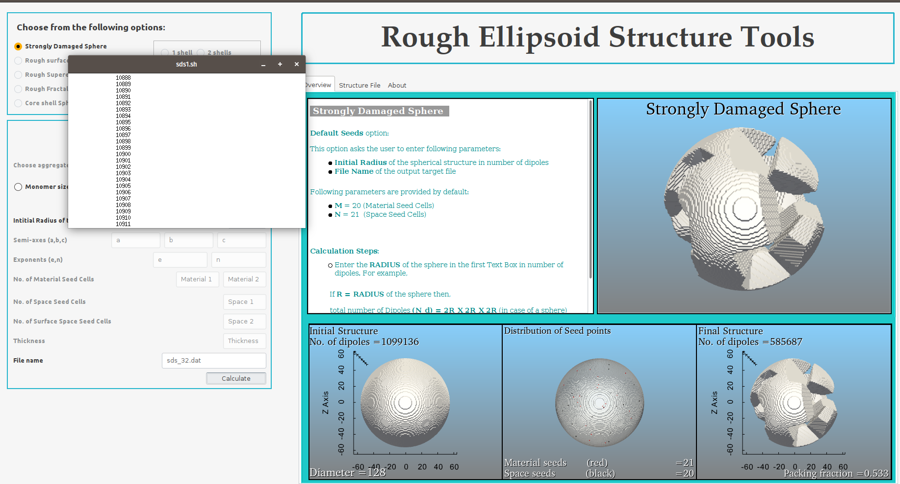
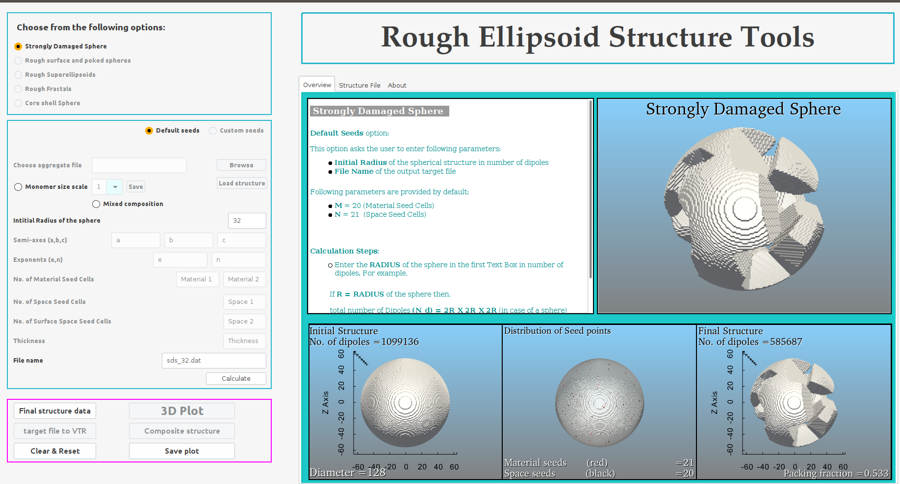
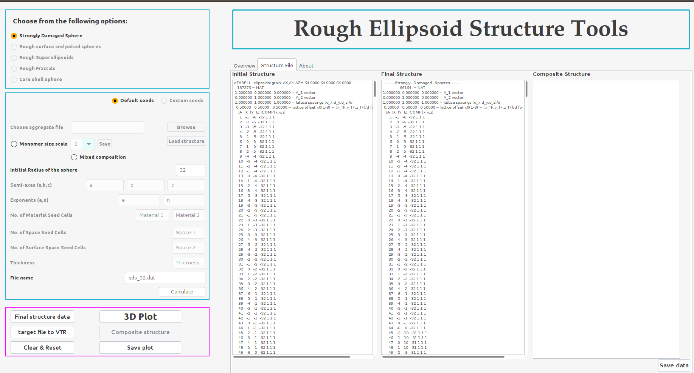
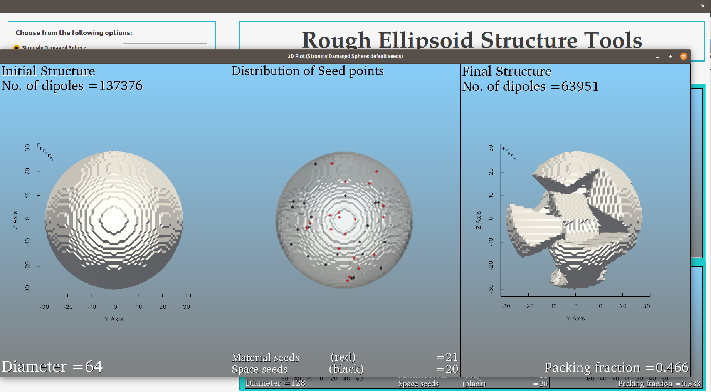

Usage
=====

.. _installation:

Dependencies
------------
Before launching the **REST** package, please ensure following dependencies are met by the system:
   1. *Java-11 (SDK)*.
   2. *gfortran*.
   3. *xterm*
   4. *Python3*
   5. *Visualization-Tool-Kit (VTK)*
   6. *PyVista-0.29.0*
   
.. warning::
   There are some issues in current versions of PyVista due to which it may not be able to plot the .VTK files. Please install *PyVista* version - 0.29.0 or lower than that. Avoid installing recent verions of *PyVista*.

Installation
------------
**REST** is very easy to install and run over a linux system or wslg.

1. Download the REST.zip file from the link.
2. Unzip the package and enter the **REST** directory.
3. Open the terminal in the **REST** directory and type the following command to launch the **REST** *GUI*:

.. code-block:: console

       $./REST.sh

First Run
---------

1. Choose the structure option from the upper left-hand box

2. Select the option **Strongly Damaged Sphere**. Upon selecting an option the input panel appears as shown below.

3. Select the **Default Seeds** option from the input panel. Enter the *Radius* of initial structure in number of dipoles (e.g. $R_d$ = 32) and enter a      filename for the final structre in the **File name** section of the input panel. Finally click the **Calculate** button to start the calculation.        During calculation an **xterm** window will open and indicate the progress of calculation as shown below.

4. Upon completion of the calculation, the control box will appear below the input panel having *pink* border.

5. Click the **Final structure data** button to import the data calculated for generating the final **SDS** structure in the **Structure file** panel on the right-hand side.

6. Finally, click the **3D Plot** button to convert all the structure data into *VTK* files and generate the 3D structures initial and final structure      along with the distribution of the different seed cells within the initial structure.

7. Save the structure data by clicking **Save data** button and save the 3D plot by clicking **Save plot** button. 
8. Reset or clear the input and output entries by clicking **Clear & Reset** button.

